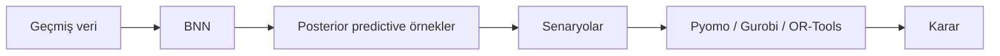
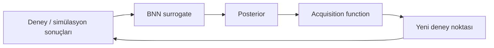
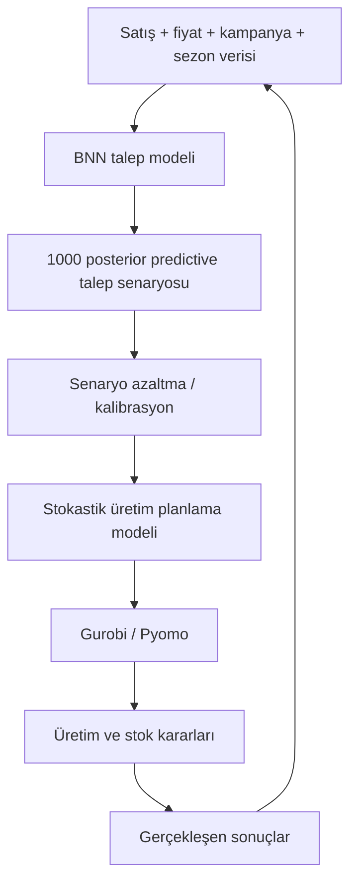

# Bayesçi Sinir Ağları ile Optimizasyon ve Yöneylem Araştırması

Bu depo, **Bayesçi Sinir Ağlarının (Bayesian Neural Networks, BNN)** belirsizlik içeren optimizasyon, endüstri mühendisliği ve yöneylem araştırması (Operations Research, OR) problemlerinde nasıl kullanılabileceğini açıklayan Türkçe bir uygulama rehberidir.

> **Son güncelleme:** 26 Ağustos 2026

Amaç yalnızca “BNN nasıl eğitilir?” sorusunu cevaplamak değildir. Asıl amaç, bir BNN'in ürettiği olasılıksal tahminleri **stok, çizelgeleme, kapasite, üretim, bakım, tedarik zinciri, simülasyon optimizasyonu, rota, kaynak tahsisi ve deney tasarımı** gibi karar problemlerine nasıl bağlayabileceğimizi göstermektir.

---

## İçindekiler

1. [Neden BNN?](#1-neden-bnn)
2. [BNN nedir?](#2-bnn-nedir)
3. [Aleatorik ve epistemik belirsizlik](#3-aleatorik-ve-epistemik-belirsizlik)
4. [Tahmin belirsizliğinden karar belirsizliğine](#4-tahmin-belirsizliğinden-karar-belirsizliğine)
5. [BNN'lerin OR ve endüstri mühendisliğinde kullanım biçimleri](#5-bnnlerin-or-ve-endüstri-mühendisliğinde-kullanım-biçimleri)
6. [Dört temel entegrasyon mimarisi](#6-dört-temel-entegrasyon-mimarisi)
7. [2026 itibarıyla hangi kütüphaneler kullanılmalı?](#7-2026-itibarıyla-hangi-kütüphaneler-kullanılmalı)
8. [Pyro, NumPyro, PyMC, BoTorch ve GPyTorch farkları](#8-pyro-numpyro-pymc-botorch-ve-gpytorch-farkları)
9. [BNN mi Gaussian Process mi?](#9-bnn-mi-gaussian-process-mi)
10. [BNN + Bayesçi Optimizasyon](#10-bnn--bayesçi-optimizasyon)
11. [BNN + stokastik programlama](#11-bnn--stokastik-programlama)
12. [BNN + sağlam ve dağılımsal olarak sağlam optimizasyon](#12-bnn--sağlam-ve-dağılımsal-olarak-sağlam-optimizasyon)
13. [BNN + chance constraints](#13-bnn--chance-constraints)
14. [BNN + CVaR ve risk-duyarlı optimizasyon](#14-bnn--cvar-ve-risk-duyarlı-optimizasyon)
15. [BNN + Pyomo / Gurobi](#15-bnn--pyomo--gurobi)
16. [BNN + çizelgeleme ve ayrık optimizasyon](#16-bnn--çizelgeleme-ve-ayrık-optimizasyon)
17. [BNN + simülasyon optimizasyonu ve dijital ikizler](#17-bnn--simülasyon-optimizasyonu-ve-dijital-ikizler)
18. [BNN + kestirimci bakım ve güvenilirlik](#18-bnn--kestirimci-bakım-ve-güvenilirlik)
19. [Kalibrasyon neden kritik?](#19-kalibrasyon-neden-kritik)
20. [Deep Ensemble, MC Dropout ve Conformal Prediction](#20-deep-ensemble-mc-dropout-ve-conformal-prediction)
21. [Uçtan uca örnek mimari](#21-uçtan-uca-örnek-mimari)
22. [Problem türüne göre önerilen teknoloji yığını](#22-problem-türüne-göre-önerilen-teknoloji-yığını)
23. [Bir araştırma veya tez nasıl tasarlanabilir?](#23-bir-araştırma-veya-tez-nasıl-tasarlanabilir)
24. [Sık yapılan hatalar](#24-sık-yapılan-hatalar)
25. [Kaynaklar](#25-kaynaklar)

---

# 1. Neden BNN?

Klasik bir sinir ağı çoğunlukla tek bir nokta tahmini üretir:

\[
\hat{y}=f_\theta(x)
\]

Bu tahmin iyi olabilir; fakat karar verici açısından çoğu zaman eksik bilgi taşır.

Örneğin bir fabrikanın yarınki talebini 1.000 adet tahmin etmek ile

\[
D \sim p(D\mid x,\mathcal D)
\]

şeklinde talebin tamamına ilişkin bir olasılık dağılımı elde etmek aynı şey değildir.

İkinci durumda şu sorulara cevap verebiliriz:

- Talebin 1.100 adedi aşma olasılığı nedir?
- %95 güven seviyesinde hangi kapasite yeterlidir?
- Aşırı stok ve stok yetersizliği maliyetleri asimetrik ise hangi üretim miktarı seçilmelidir?
- Kötü senaryoların ortalama maliyetini temsil eden CVaR ne kadardır?
- Model hangi bölgelerde veri yetersizliği nedeniyle kararsızdır?

BNN'lerin optimizasyon açısından değeri tam olarak burada ortaya çıkar: **nokta tahmininden dağılım tabanlı karar vermeye geçiş**.

---

# 2. BNN nedir?

Standart bir sinir ağında ağırlıklar sabit parametrelerdir:

\[
w=\hat w
\]

Bayesçi sinir ağında ise ağırlıklar rassal değişkenler olarak modellenir:

\[
w\sim p(w)
\]

Veri gözlendikten sonra Bayes kuralıyla posterior dağılım hedeflenir:

\[
p(w\mid\mathcal D)
\propto
p(\mathcal D\mid w)p(w)
\]

Yeni bir \(x^*\) noktası için posterior predictive dağılım:

\[
p(y^*\mid x^*,\mathcal D)
=
\int
p(y^*\mid x^*,w)
p(w\mid\mathcal D)\,dw
\]

şeklindedir.

Bu integral çoğu gerçek BNN için analitik olarak hesaplanamaz. Bu nedenle pratikte:

- Variational Inference,
- HMC / NUTS,
- MCMC,
- Laplace yaklaşımları,
- posterior sampling

gibi yöntemler kullanılır.

Posterior'dan örnekler alırsak:

\[
w^{(s)}\sim p(w\mid\mathcal D)
\]

her bir ağırlık örneği için

\[
y^{(s)}=f(x,w^{(s)})
\]

elde edilir. Böylece BNN çıktısını doğrudan **senaryo üreticisi** olarak kullanabiliriz.

---

# 3. Aleatorik ve epistemik belirsizlik

BNN kullanırken iki temel belirsizlik türünü ayırmak önemlidir.

## 3.1 Aleatorik belirsizlik

Sistemin doğasındaki azaltılamayan rassallıktır.

Örnekler:

- müşteri talebindeki doğal değişkenlik,
- makine işlem süresindeki değişkenlik,
- ulaşım süresindeki trafik kaynaklı oynaklık,
- ölçüm gürültüsü,
- üretim kalitesindeki doğal varyasyon.

Daha fazla veri toplamak bu belirsizliği tamamen yok etmez.

## 3.2 Epistemik belirsizlik

Modelin yeterince bilgi sahibi olmamasından doğar.

Örnekler:

- yeni ürün için az veri,
- yeni makine tipi,
- daha önce denenmemiş proses parametreleri,
- veri uzayının kenar bölgeleri,
- yeni tedarikçi.

Daha fazla ve doğru veriyle azaltılabilir.

BNN'lerin önemli avantajlarından biri özellikle **epistemik belirsizliği** temsil edebilmesidir.

Bu ayrım optimizasyonda önemlidir. Eğer model belirli bir karar bölgesinde yüksek epistemik belirsizlik gösteriyorsa, optimizasyon algoritması o bölgeyi ya temkinli biçimde ele alabilir ya da yeni deney yaparak bilgi toplayabilir.

---

# 4. Tahmin belirsizliğinden karar belirsizliğine

Bir BNN'in çıktı dağılımı üretmesi tek başına karar problemini çözmez.

BNN şu dağılımı üretebilir:

\[
p(Y\mid x,\mathcal D)
\]

ama karar vericinin ayrıca bir amaç ve risk tercihi tanımlaması gerekir.

Risk-nötr problem:

\[
\min_x \mathbb E[C(x,Y)]
\]

Risk-duyarlı problem:

\[
\min_x \operatorname{CVaR}_{0.95}(C(x,Y))
\]

Şans kısıtlı problem:

\[
P(g(x,Y)\leq0)\geq1-\alpha
\]

Çok amaçlı problem:

\[
\min_x
\left(
\mathbb E[C(x,Y)],
\operatorname{CVaR}(C(x,Y)),
CO_2(x)
\right)
\]

Dolayısıyla temel ayrım şudur:

> **BNN belirsizliği modeller; optimizasyon modeli ise bu belirsizlik altında hangi kararın tercih edileceğini belirler.**

---

# 5. BNN'lerin OR ve endüstri mühendisliğinde kullanım biçimleri

BNN'ler aşağıdaki problem sınıflarında anlamlı olabilir.

## Üretim planlama

BNN ile:

- talep,
- üretim hızı,
- hurda oranı,
- enerji tüketimi,
- proses verimi

tahmin edilir; posterior senaryolar üretim planlama modeline aktarılır.

## Stok yönetimi

Talep dağılımı klasik Normal/Poisson varsayımlarına uymuyorsa BNN esnek bir koşullu talep dağılımı öğrenebilir.

## Çizelgeleme

BNN işlem sürelerini, arıza olasılıklarını veya teslimat sürelerini tahmin eder. Bu belirsiz süreler senaryo tabanlı MILP/CP modellerine aktarılabilir.

## Tedarik zinciri

BNN:

- lead time,
- talep,
- tedarikçi gecikmesi,
- kapasite kaybı,
- taşıma süresi

gibi belirsiz parametrelerin koşullu dağılımını öğrenebilir.

## Kestirimci bakım

Kalan faydalı ömür veya arıza riski dağılımı, bakım planlama optimizasyonuna girdi olur.

## Simülasyon optimizasyonu

Pahalı bir ayrık olay simülasyonu veya dijital ikiz yerine BNN surrogate kullanılabilir.

## Deney tasarımı

Posterior belirsizlik hangi deneyin daha fazla bilgi sağlayacağını belirlemek için kullanılabilir.

## Enerji ve proses optimizasyonu

Enerji tüketimi, kalite veya proses çıktısının belirsiz response surface'i BNN ile modellenebilir.

---

# 6. Dört temel entegrasyon mimarisi

BNN + optimizasyon projelerini dört ana mimari altında düşünmek yararlıdır.

## Mimari A — Posterior → Senaryo → Matematiksel programlama



En doğal OR entegrasyonlarından biridir.

Örneğin:

\[
D^{(s)}\sim p(D\mid\mathcal D)
\]

ve

\[
\min_x
\frac{1}{S}
\sum_{s=1}^{S}C(x,D^{(s)})
\]

şeklinde bir Sample Average Approximation (SAA) kurulabilir.

## Mimari B — BNN surrogate → Bayesçi optimizasyon



Pahalı black-box fonksiyonlarda kullanılır.

## Mimari C — BNN → Risk ölçüsü → Optimizasyon

BNN posteriorundan maliyet dağılımı elde edilir:

\[
C^{(s)}(x)
\]

sonra örneğin CVaR minimize edilir.

## Mimari D — BNN → Öğrenilmiş katsayı / kısıt → MILP/MINLP

Örneğin BNN belirli ürün ve makine kombinasyonlarında işlem sürelerini tahmin eder. Bu değerler çizelgeleme modelinin katsayılarına dönüşür.

---

# 7. 2026 itibarıyla hangi kütüphaneler kullanılmalı?

Ağustos 2026 itibarıyla tek bir “en iyi BNN kütüphanesi” yoktur. Seçim, problemin hangi katmanını çözmek istediğinize bağlıdır.

| Araç | Ana rol | Güçlü taraf | OR açısından kullanım |
|---|---|---|---|
| **PyTorch** | Derin öğrenme altyapısı | Esnek NN ekosistemi | BNN/surrogate tabanı |
| **Pyro** | Olasılıksal programlama | SVI, HMC, NUTS, autoguide | BNN posterior üretimi |
| **JAX + NumPyro** | Hızlı Bayesçi çıkarım | JIT, vectorization, NUTS, SVI | Posterior + senaryo üretimi |
| **PyMC** | Bayesçi istatistik | Güçlü modelleme ve diagnostik | Talep, güvenilirlik, hiyerarşik modeller |
| **GPyTorch** | Gaussian Process | Ölçeklenebilir GP, variational GP | Surrogate modeling |
| **BoTorch** | Bayesçi optimizasyon | Acquisition ve MC posterior API | Black-box / simülasyon optimizasyonu |
| **Ax** | Adaptif deney yönetimi | Deney/trial orchestration | DOE, proses optimizasyonu |
| **Pyomo** | Matematiksel programlama | LP/MILP/NLP modelleme | Karar katmanı |
| **Gurobi** | Matematiksel optimizasyon solver'ı | Çok güçlü LP/MILP/QP çözücü | Karar katmanı |
| **OR-Tools** | Kombinatoryal optimizasyon | CP-SAT, routing | Çizelgeleme / rota / atama |
| **CVXPY** | Konveks modelleme | Kolay prototipleme | Risk/portföy/konveks modeller |

### Genel amaçlı önerilen teknoloji yığını

Yeni bir araştırma projesi için güçlü varsayılan kombinasyon:

```text
PyTorch
   ↓
Pyro veya GPyTorch
   ↓
BoTorch / Ax
   ↓
Pyomo veya Gurobi
```

Bayesçi çıkarımın kalitesinin ön planda olduğu projelerde:

```text
JAX
  ↓
NumPyro
  ↓
Posterior samples
  ↓
Pyomo / Gurobi / CVXPY
```

İstatistiksel/hiyerarşik modellemenin ağır bastığı projelerde:

```text
PyMC
 ↓
Posterior predictive
 ↓
Scenario generation
 ↓
Optimization model
```

---

# 8. Pyro, NumPyro, PyMC, BoTorch ve GPyTorch farkları

Bu kütüphaneler birbirlerinin birebir alternatifi değildir.

## Pyro

PyTorch üzerinde olasılıksal programlama sağlar.

BNN için özellikle:

- `PyroModule`,
- `PyroSample`,
- SVI,
- ELBO,
- AutoGuide,
- HMC,
- NUTS,
- `Predictive`

bileşenleri değerlidir.

Büyük BNN'lerde genellikle exact posterior yerine variational inference gerekir.

## NumPyro

JAX üzerinde çalışır.

Avantajları:

- JIT compilation,
- vectorization,
- GPU/TPU uyumu,
- NUTS/HMC,
- SVI,
- açık BNN örnekleri.

Küçük/orta modellerde NUTS, posterior kalitesi için çok güçlü bir referans yöntem olabilir.

## PyMC

BNN yapılabilir; ancak PyMC'nin asıl gücü yalnızca neural network değildir.

Özellikle:

- hiyerarşik talep,
- güvenilirlik,
- bakım,
- zaman serisi,
- heterojen müşteri/ürün etkileri,
- parametre belirsizliği

gibi modellerde çok değerlidir.

## GPyTorch

BNN kütüphanesi değildir.

Gaussian Process modellerine odaklanır:

- exact GP,
- variational/approximate GP,
- multitask GP,
- Deep GP,
- deep kernel learning.

Özellikle az sayıda pahalı değerlendirme bulunan Bayesçi optimizasyon problemlerinde çoğu zaman BNN'den önce denenmelidir.

## BoTorch

BoTorch bir BNN eğitim kütüphanesi değildir.

Görevi **Bayesçi optimizasyon**dur.

BoTorch'un `Model` ve `Posterior` arayüzleri GP dışında özel modelleri de destekler. Monte Carlo tabanlı acquisition function'lar için posteriorun örneklenebilir olması yeterlidir. Dolayısıyla uygun bir wrapper ile BNN posterioru BoTorch acquisition fonksiyonlarına bağlanabilir.

## Ax

Ax, deneylerin yönetim katmanıdır.

- search space,
- objective,
- trial,
- constraint,
- deney sırası,
- adaptif parameter tuning

gibi kavramları yönetir.

BoTorch daha algoritmik alt katmanken Ax daha yüksek seviyeli deney/optimizasyon iş akışı sağlar.

---

# 9. BNN mi Gaussian Process mi?

Bu önemli bir metodolojik seçimdir.

BNN kullanmak “daha modern” olduğu için otomatik olarak daha doğru değildir.

## GP'nin güçlü olduğu durumlar

- veri az,
- fonksiyon değerlendirmesi pahalı,
- boyut düşük/orta,
- uncertainty calibration kritik,
- simülasyon veya fiziksel deney maliyetli.

Örnek:

Bir üretim simülasyonu 45 dakika sürüyorsa ve yalnızca 100 deney yapabiliyorsak GP çoğu zaman çok iyi başlangıçtır.

## BNN'nin güçlü olduğu durumlar

- veri daha büyük,
- giriş boyutu yüksek,
- görüntü/sensör/zaman serisi gibi karmaşık özellikler var,
- response function yüksek derecede nonlinear,
- GP ölçeklenmesi problem oluyor.

Pratik seçim kuralı:

\[
\text{az veri + pahalı deney} \Rightarrow \text{GP'yi önce dene}
\]

\[
\text{yüksek boyut + büyük veri + karmaşık yapı} \Rightarrow \text{BNN düşün}
\]

---

# 10. BNN + Bayesçi Optimizasyon

Bayesçi optimizasyonun temel döngüsü:

1. birkaç başlangıç noktası değerlendir,
2. surrogate model eğit,
3. posterior uncertainty hesapla,
4. acquisition function optimize et,
5. yeni noktayı gerçek sistemde değerlendir,
6. modele ekle,
7. tekrarla.

## Acquisition function

Surrogate model posterioru:

\[
p(f(x)\mid \mathcal D)
\]

üretir.

Acquisition function bu dağılımı kullanarak bir sonraki deneyi seçer.

Örnekler:

- Expected Improvement,
- Log Expected Improvement,
- Probability of Improvement,
- Upper Confidence Bound,
- qEI,
- qNEI,
- qEHVI / qNEHVI,
- constrained acquisition functions.

UCB'nin sezgisel formu:

\[
\alpha_{UCB}(x)=\mu(x)+\sqrt{\beta}\sigma(x)
\]

Burada:

- \(\mu\): exploitation,
- \(\sigma\): exploration.

BNN'nin epistemik uncertainty'si exploration kararını yönlendirebilir.

## Çok amaçlı optimizasyon

Endüstri mühendisliğinde tek amaç nadirdir.

Örneğin:

\[
\min \text{maliyet}
\]

\[
\min \text{enerji}
\]

\[
\max \text{kalite}
\]

aynı anda ele alınabilir.

BoTorch'un çok amaçlı acquisition araçları bu tür deneysel/proses optimizasyonlarında önemlidir.

---

# 11. BNN + stokastik programlama

BNN posterior predictive dağılımından senaryolar üretelim:

\[
\xi^{(1)},\xi^{(2)},\dots,\xi^{(S)}
\sim p(\xi\mid\mathcal D)
\]

İki aşamalı stokastik programlama:

\[
\min_x c^T x + \mathbb E_{\xi}[Q(x,\xi)]
\]

SAA yaklaşımı:

\[
\min_x
c^Tx+
\frac{1}{S}
\sum_{s=1}^{S}Q(x,\xi^{(s)})
\]

BNN'nin rolü burada dağılımı veya senaryoları üretmektir.

### Örnek: kapasite planlama

BNN gelecek talebi koşullu olarak tahmin etsin:

\[
D_t^{(s)}\sim p(D_t\mid X_t,\mathcal D)
\]

Birinci aşama:

- kapasite yatırımı.

İkinci aşama:

- fazla mesai,
- dış kaynak,
- stok yetersizliği,
- üretim ayarlamaları.

BNN posterior senaryoları recourse maliyetini belirler.

---

# 12. BNN + sağlam ve dağılımsal olarak sağlam optimizasyon

BNN ile robust optimization aynı şey değildir.

Klasik robust optimization:

\[
\min_x\max_{\xi\in\mathcal U} C(x,\xi)
\]

şeklinde bir belirsizlik kümesi \(\mathcal U\) kullanır.

BNN ise posterior predictive dağılım üretir.

Bu posterior bilgisi:

- uncertainty set kurmak,
- quantile tabanlı sınırlar üretmek,
- senaryo kümesi oluşturmak,
- ambiguity set parametrelerini öğrenmek

için kullanılabilir.

Distributionally Robust Optimization (DRO) özellikle distribution shift riskinin bulunduğu endüstriyel problemlerde önemlidir.

Örneğin eğitim verisinde görülmeyen yeni pazar koşullarında yalnızca BNN posterioruna güvenmek aşırı iyimser olabilir.

---

# 13. BNN + chance constraints

Bir kapasite kısıtı düşünelim:

\[
P(D\leq x)\geq0.95
\]

BNN'den \(S\) talep senaryosu üretirsek:

\[
D^{(1)},...,D^{(S)}
\]

ampirik olasılık:

\[
\hat P(D\leq x)
=
\frac{1}{S}
\sum_s
\mathbf 1(D^{(s)}\leq x)
\]

ile yaklaşık hesaplanabilir.

Bu tür modeller:

- servis seviyesi,
- kapasite güvenilirliği,
- teslimat süresi,
- güvenlik stoku,
- enerji sınırları

gibi problemlerde kullanılabilir.

---

# 14. BNN + CVaR ve risk-duyarlı optimizasyon

Beklenen maliyet yalnızca ortalamaya odaklanır.

Ancak operasyonlarda nadir fakat pahalı olaylar önemli olabilir.

Value-at-Risk:

\[
VaR_\alpha(C)
\]

maliyet dağılımının \(\alpha\) quantile'ıdır.

CVaR ise kuyruktaki kötü maliyetlerin ortalamasını hedefler.

\[
CVaR_\alpha(C)
\]

BNN posteriorundan maliyet senaryoları:

\[
C^{(1)}(x),...,C^{(S)}(x)
\]

üretilerek risk-duyarlı problem kurulabilir:

\[
\min_x
\mathbb E[C(x)]
+
\lambda CVaR_{0.95}(C(x))
\]

Bu yaklaşım:

- tedarik zinciri kesintisi,
- enerji maliyet riski,
- stok yetersizliği,
- bakım arızası,
- finansal/operasyonel risk

için uygundur.

---

# 15. BNN + Pyomo / Gurobi

Pyomo ve Gurobi BNN framework'leri değildir. Bunlar **karar optimizasyonu katmanıdır**.

Temel entegrasyon:

```text
Veri
 ↓
BNN
 ↓
Posterior predictive samples
 ↓
Scenario matrix
 ↓
Pyomo / Gurobi
 ↓
Optimal karar
```

Örnek Python-benzeri pseudocode:

```python
# BNN posteriorundan talep senaryoları
samples = posterior_predictive(X_future, num_samples=1000)

# samples: [scenario, period, product]
demand = samples["demand"]

# Ardından Pyomo/Gurobi modelinde
# her senaryo için recourse maliyetleri tanımlanır.
```

## BNN'yi doğrudan optimizasyon modelinin içine gömmek

Eğitilmiş deterministik neural network'leri MIP içine gömmek mümkündür; ancak tam bir Bayesian posterioru “tek bir neural network” değildir.

BNN için daha yaygın strateji:

1. posterior weight sample al,
2. her sample için response üret,
3. senaryoları azalt / özetle,
4. matematiksel modele aktar.

Çok sayıda posterior network'ü doğrudan MIP içine koymak hızla hesaplama açısından pahalı hale gelebilir.

---

# 16. BNN + çizelgeleme ve ayrık optimizasyon

Job-shop veya parallel machine scheduling probleminde işlem süreleri belirsiz olabilir.

BNN:

\[
p_{ij}\sim p(p_{ij}\mid x_{ij},\mathcal D)
\]

şeklinde işlem süresi dağılımı tahmin edebilir.

Sonra senaryolar:

\[
p_{ij}^{(s)}
\]

üretilir.

Amaç örneğin:

\[
\min \mathbb E[C_{max}]
\]

veya

\[
\min CVaR_{0.95}(C_{max})
\]

olabilir.

Kullanılabilecek solver'lar:

- Gurobi,
- Pyomo + MILP solver,
- OR-Tools CP-SAT.

Ayrık optimizasyonda BNN posteriorunun differentiable olması zorunlu değildir; çünkü posterior örnekleri önce senaryoya çevrilebilir.

---

# 17. BNN + simülasyon optimizasyonu ve dijital ikizler

Bir ayrık olay simülasyonu pahalıysa:

\[
y=f(x)+\epsilon
\]

ilişkisi bir surrogate ile öğrenilebilir.

Örneğin:

- \(x\): personel sayısı, buffer kapasitesi, hız, bakım politikası,
- \(y\): throughput, waiting time, maliyet.

BNN surrogate:

\[
p(y\mid x,\mathcal D)
\]

üretir.

Bu iki şekilde kullanılabilir:

### Yaklaşım 1: surrogate optimization

BNN üzerinde doğrudan candidate search yapılır.

### Yaklaşım 2: Bayesian optimization

BNN posterior uncertainty acquisition function'a bağlanır ve pahalı simülasyon yalnızca seçilmiş noktalarda çalıştırılır.

Bu yapı digital twin optimizasyonunda özellikle değerlidir.

---

# 18. BNN + kestirimci bakım ve güvenilirlik

Bir makinenin kalan faydalı ömrü:

\[
RUL\sim p(RUL\mid X,\mathcal D)
\]

olarak modellenebilir.

Optimizasyon modeli şunlar arasında denge kurar:

- erken bakım maliyeti,
- plansız arıza maliyeti,
- üretim kaybı,
- bakım ekibi kapasitesi,
- yedek parça stoku.

Basit biçimde:

\[
\min_x
C_{maintenance}(x)
+
\mathbb E[C_{failure}(x,RUL)]
\]

Risk-duyarlı sürüm:

\[
\min_x
C_{maintenance}(x)
+
\lambda CVaR(C_{failure})
\]

Bu nedenle BNN'nin predictive uncertainty'si yalnızca “confidence interval göstermek” için değil, doğrudan bakım zamanlamasını değiştirmek için kullanılmalıdır.

---

# 19. Kalibrasyon neden kritik?

Bir modelin uncertainty üretmesi, uncertainty'nin doğru olduğu anlamına gelmez.

Örneğin model %90 prediction interval veriyorsa, uzun vadede gerçek gözlemlerin yaklaşık %90'ının bu aralıklarda kalması beklenir.

Eğer coverage %65 ise:

- chance constraint hatalı olabilir,
- safety stock yetersiz kalabilir,
- CVaR küçümsenebilir,
- optimizer aşırı agresif karar verebilir.

Bu nedenle sadece RMSE kullanmak yeterli değildir.

İzlenebilecek metrikler:

- RMSE / MAE,
- Negative Log Likelihood,
- CRPS,
- prediction interval coverage,
- calibration error,
- sharpness,
- karar maliyeti,
- constraint violation rate,
- out-of-sample CVaR.

Endüstri mühendisliği için son iki grup genellikle en önemlisidir.

---

# 20. Deep Ensemble, MC Dropout ve Conformal Prediction

BNN belirsizlik modellemenin tek yolu değildir.

## Deep Ensemble

Birden fazla bağımsız neural network eğitilir:

\[
f_1(x),...,f_M(x)
\]

Modeller arası varyasyon epistemik uncertainty için pratik bir proxy olabilir.

Avantajları:

- uygulaması kolay,
- paralelleştirilebilir,
- çoğu problemde güçlü baseline.

Araştırma çalışmasında BNN'nin mutlaka deep ensemble ile karşılaştırılması önerilir.

## MC Dropout

Tahmin zamanında dropout açık tutulur ve birden fazla forward pass yapılır.

Ucuz bir approximate uncertainty yöntemi olabilir; ancak tam Bayesçi posterior olarak görülmemelidir.

## Conformal Prediction

Conformal yöntemler modelden bağımsız prediction set/interval coverage elde etmek için kullanılabilir.

Güçlü bir pratik mimari:

```text
BNN
 ↓
posterior predictive
 ↓
conformal calibration
 ↓
risk-aware optimization
```

Özellikle modelin uncertainty calibration'ının doğrudan servis seviyesi veya güvenlik kısıtlarına bağlandığı problemlerde değerlidir.

## Distribution shift

BNN posterior uncertainty, distribution shift problemini otomatik olarak çözmez.

Yeni:

- ürün,
- makine,
- pazar,
- tedarikçi,
- iklim,
- proses rejimi

görüldüğünde OOD detection ve robust/DRO yöntemleri de düşünülmelidir.

---

# 21. Uçtan uca örnek mimari

Bir üretim planlama problemi düşünelim.

Talep geçmişten öğreniliyor ve gelecek 12 hafta için üretim kararı veriliyor.



Matematiksel olarak:

\[
D_t^{(s)}\sim p(D_t\mid X_t,\mathcal D)
\]

ve

\[
\min
\frac1S\sum_s
\left[
\sum_t c_p P_t
+
c_h I_t^{(s)}
+
c_b B_t^{(s)}
\right]
\]

kısıt:

\[
I_{t-1}^{(s)} + P_t - D_t^{(s)}
=
I_t^{(s)}-B_t^{(s)}
\]

Bu yapı klasik “predict then optimize” yaklaşımından farklıdır; çünkü modele yalnızca tahmin ortalaması değil, posterior predictive dağılım aktarılır.

---

# 22. Problem türüne göre önerilen teknoloji yığını

| Problem | İlk tercih |
|---|---|
| Az veri + pahalı simülasyon | GPyTorch + BoTorch |
| Yüksek boyutlu black-box optimizasyon | PyTorch/Pyro BNN + BoTorch |
| Adaptif deney / DOE | Ax + BoTorch |
| Çok amaçlı proses optimizasyonu | BoTorch + Ax |
| Talep belirsizliği + stok | PyMC/NumPyro + Pyomo/Gurobi |
| Kapasite planlama | PyMC/NumPyro/Pyro + Pyomo/Gurobi |
| Stokastik tedarik zinciri | BNN/posterior model + Pyomo/Gurobi |
| Çizelgeleme + belirsiz işlem süreleri | BNN + Gurobi/OR-Tools |
| Kestirimci bakım | Pyro/NumPyro + MILP/CP |
| Güvenilirlik optimizasyonu | PyMC/NumPyro + optimizer |
| Dijital ikiz optimizasyonu | PyTorch/Pyro + BoTorch/Ax |
| Pahalı fiziksel deney | GP/BNN + BoTorch |
| Chance-constrained problem | Posterior samples + Pyomo/Gurobi |
| CVaR optimizasyonu | Posterior samples + Pyomo/CVXPY/Gurobi |
| Routing + belirsiz seyahat süresi | probabilistic model + OR-Tools/Gurobi |

---

# 23. Bir araştırma veya tez nasıl tasarlanabilir?

BNN + OR çalışmasında yalnızca tahmin performansını ölçmek yeterli değildir.

## Önerilen karşılaştırma

### Tahmin modelleri

1. deterministik neural network,
2. MC Dropout,
3. deep ensemble,
4. variational BNN,
5. GP (uygunsa).

### Tahmin metrikleri

- RMSE,
- MAE,
- NLL,
- CRPS,
- calibration,
- prediction interval coverage.

### Karar metrikleri

- expected operational cost,
- regret,
- CVaR,
- service level,
- stockout rate,
- constraint violation,
- makespan,
- enerji kullanımı,
- çözüm süresi.

### Örnek araştırma sorusu

> Posterior uncertainty kullanan BNN tabanlı stokastik üretim planlama modeli, nokta tahmini kullanan deterministik NN + MILP yaklaşımına kıyasla out-of-sample maliyet ve servis seviyesi açısından daha iyi kararlar üretiyor mu?

Bu soru yalnızca ML accuracy değil **decision quality** ölçer.

## Ablation çalışmaları

Aşağıdaki etkiler ayrı ayrı incelenebilir:

- posterior sample sayısı,
- prior seçimi,
- VI vs NUTS,
- calibration uygulanması,
- CVaR katsayısı,
- scenario reduction,
- veri miktarı,
- distribution shift.

---

# 24. Sık yapılan hatalar

## Hata 1 — BNN uncertainty var diye otomatik olarak güvenilir kabul etmek

Posterior calibration mutlaka kontrol edilmelidir.

## Hata 2 — BNN'yi her problemde GP yerine kullanmak

Küçük veri ve pahalı objective durumunda GP çoğu kez daha uygun ilk modeldir.

## Hata 3 — Sadece RMSE raporlamak

Optimizasyon problemi için decision quality raporlanmalıdır.

## Hata 4 — Aleatorik ve epistemik uncertainty'yi karıştırmak

Bu iki belirsizlik karar açısından farklı anlam taşır.

## Hata 5 — BNN posteriorunu robust optimization garantisi sanmak

Bayesian predictive uncertainty ile worst-case robustness farklı kavramlardır.

## Hata 6 — Posterior senaryolarını sınırsız sayıda MILP'ye taşımak

Senaryo sayısı büyüdükçe matematiksel model çok pahalı olabilir. Scenario reduction / decomposition düşünülmelidir.

## Hata 7 — Distribution shift'i görmezden gelmek

OOD bölgelerinde posterior uncertainty'nin davranışı ayrıca test edilmelidir.

## Hata 8 — Model kalitesi ile karar kalitesini aynı şey sanmak

En düşük RMSE'ye sahip model her zaman en düşük operasyonel maliyeti vermez.

---

# 25. Kaynaklar

Aşağıdaki resmi dokümantasyonlar güncel uygulama için iyi başlangıç noktalarıdır.

### Pyro

- Pyro Documentation: https://docs.pyro.ai/en/stable/
- Inference / SVI / MCMC: https://docs.pyro.ai/en/stable/inference.html
- Automatic Guides: https://docs.pyro.ai/en/stable/infer.autoguide.html

### NumPyro

- NumPyro Documentation: https://num.pyro.ai/en/stable/
- Bayesian Neural Network örneği: https://num.pyro.ai/en/stable/examples/bnn.html
- SVI: https://num.pyro.ai/en/latest/svi.html

### PyMC

- PyMC Documentation: https://www.pymc.io/projects/docs/en/stable/
- Variational Inference: https://www.pymc.io/projects/docs/en/stable/api/vi.html

### BoTorch

- BoTorch Documentation: https://botorch.org/docs/
- Models: https://botorch.org/docs/models
- Getting Started: https://botorch.org/docs/getting_started

BoTorch 2026 dokümantasyonundaki önemli nokta: Monte Carlo acquisition fonksiyonları yalnızca GP'lerle sınırlı değildir. `Model` arayüzü üzerinden posterior üretebilen özel modeller de kullanılabilir. Bu, BNN surrogate entegrasyonunun temel yoludur.

### Ax

- Ax Documentation: https://ax.dev/
- Quickstart: https://ax.dev/docs/tutorials/quickstart/

### GPyTorch

- GPyTorch Documentation: https://docs.gpytorch.ai/en/stable/

### Pyomo

- Pyomo Documentation: https://pyomo.readthedocs.io/

### Gurobi

- Gurobi Documentation: https://docs.gurobi.com/
- Gurobi Machine Learning: https://gurobi-machinelearning.readthedocs.io/

### OR-Tools

- Google OR-Tools: https://developers.google.com/optimization

---

# Sonuç

BNN'lerin endüstri mühendisliği ve yöneylem araştırmasındaki en yararlı rolü “daha gelişmiş bir tahmin modeli” olmaktan çok **belirsizliği karar modeline taşıyan probabilistic interface** olmalarıdır.

En genel mimari:

\[
\boxed{
\text{Veri}
\rightarrow
\text{Probabilistic model / BNN}
\rightarrow
\text{Calibration}
\rightarrow
\text{Posterior predictive scenarios}
\rightarrow
\text{Risk modeli}
\rightarrow
\text{Optimizasyon}
\rightarrow
\text{Decision quality evaluation}
}
\]

2026 itibarıyla güçlü bir genel amaçlı araştırma yığını:

\[
\boxed{
\text{PyTorch}
+
\text{Pyro/GPyTorch}
+
\text{BoTorch/Ax}
+
\text{Pyomo/Gurobi}
}
\]

olarak düşünülebilir.

Fakat araç seçimi problem türüne göre yapılmalıdır:

- **küçük veri + pahalı objective:** GP + BoTorch,
- **yüksek boyut + karmaşık response:** BNN + BoTorch,
- **hiyerarşik/istatistiksel belirsizlik:** PyMC veya NumPyro,
- **stokastik karar:** posterior samples + Pyomo/Gurobi,
- **çizelgeleme/routing:** probabilistic model + MILP/CP,
- **risk duyarlılığı:** posterior + CVaR/chance constraints/DRO.

Son değerlendirme ölçütü yalnızca tahmin hatası olmamalıdır. Endüstri mühendisliği açısından asıl soru şudur:

> **Belirsizliği daha iyi modellemek gerçekten daha iyi operasyonel karar üretiyor mu?**

Bu depo bu sorunun etrafında genişletilebilir.